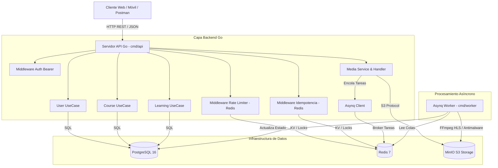
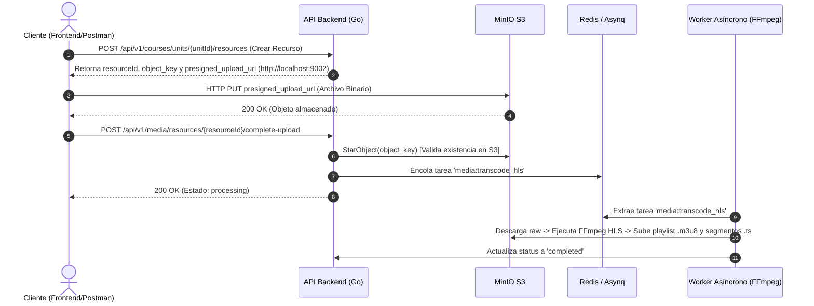
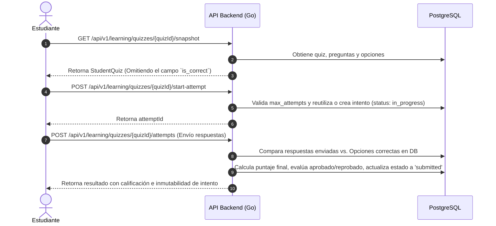
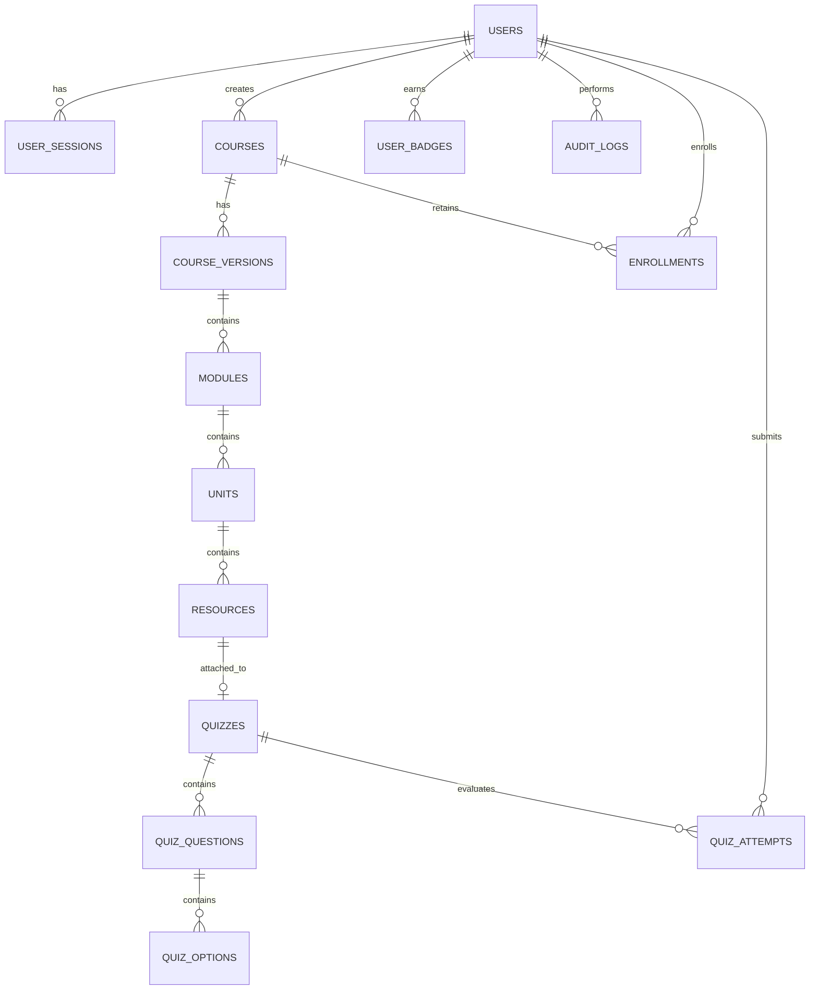

# 🏛️ Informe de Arquitectura de Software — Plataforma MOOC

Este documento describe la arquitectura de software, patrones de diseño, esquema de persistencia, flujos de procesamiento y decisiones técnicas de la **Plataforma Web de Cursos Masivos Abiertos en Línea (MOOC)**.

---

## 📚 1. Visión General del Sistema

El backend de la plataforma MOOC está diseñado como un **Monolito Modular** escrito en **Go (Golang)**, acoplado con **Trabajadores Asíncronos (Async Workers)** impulsados por **Redis y Asynq**. El sistema proporciona una API RESTful escalable y resiliente capaz de gestionar la autoría de cursos, control de versiones inmutables, reproducción multimedia con transcodificación HLS adapativa, evaluación con calificación server-side, seguimiento de progreso y emisión de insignias digitales verificables.

### 🛠️ Stack Tecnológico

| Componente | Tecnología | Propósito |
| :--- | :--- | :--- |
| **Lenguaje Backend** | Go 1.25 | Alto rendimiento, concurrencia nativa y bajo consumo de memoria. |
| **Router HTTP** | Chi v5 | Enrutador ligero, de alto rendimiento y compatible con `net/http`. |
| **Base de Datos Relacional**| PostgreSQL 16 | Almacenamiento primario ACID para usuarios, cursos, quizzes y progreso. |
| **Caché y Colas** | Redis 7 + Asynq | Limitación de tasa (Rate Limiting), Idempotencia y colas de tareas asíncronas. |
| **Almacenamiento S3** | MinIO (S3 Compatible) | Almacenamiento de archivos multimedia, PDFs e insignias emitidas. |
| **Servidor de Correo** | Mailpit | Captura SMTP local para verificación de correo y restablecimiento de contraseña. |
| **Transcodificación** | FFmpeg | Conversión asíncrona de video/audio a segmentos streaming HLS (`.m3u8` / `.ts`). |
| **Contenedorización** | Docker & Docker Compose | Orquestación completa del stack de desarrollo y producción. |
| **Especificación API** | OpenAPI 3.1 / Swagger UI | Especificación formal y documentación interactiva expuesta en `/docs/`. |

---

## 📐 2. Principios de Diseño e Invariantes del Dominio

1. **Separación Limpia de Dominios (Clean Architecture)**:
   - El código se organiza en dominios independientes (`user`, `course`, `media`, `learning`) con contratos claros mediante interfaces en `internal/domain`.

2. **Inmutabilidad de Versiones Publicadas**:
   - Una versión de curso con estado `published` jamás se modifica in-place para preservar la integridad del aprendizaje de los estudiantes inscritos.
   - Cualquier actualización requiere invocar `/create-draft`, lo que duplica la jerarquía creando un borrador (`draft`) que mantiene **IDs estables (`stable_id`)** para reanudar el progreso sin pérdidas.

3. **Carga Directa a Almacenamiento S3 (Direct-to-S3 Upload)**:
   - El backend **no actúa de proxy** para los archivos pesados de video/audio. En su lugar, emite URLs de subida prefirmadas (`presigned_upload_url`) con firmas AWS SigV4 adaptadas al host externo (`http://localhost:9002`), permitiendo a los clientes realizar cargas binarias `PUT` directamente a MinIO.

4. **Evaluaciones con Calificación 100% Server-Side**:
   - La estructura entregada a los estudiantes (`StudentQuizOption`) excluye strictly el campo `is_correct`.
   - La evaluación de respuestas y asignación de notas se realiza exclusivamente en el servidor al momento del envío del intento, generando registros inmutables de calificación.

5. **Resiliencia de Progreso e Insignias Verificables**:
   - La permanencia en servidor se calcula validando pulsos periódicos (`/heartbeat`). Al completar el 100% de recursos obligatorios y aprobar los quizzes, el sistema genera de forma automática un certificado/insignia con UUID público verificable.

---

## 🧱 3. Arquitectura de Componentes



---

## 🗂️ 4. Estructura de Paquetes y Módulos Go

```text
backend/
├── cmd/
│   ├── api/             # Punto de entrada HTTP, inicialización de dependencias y rutas Chi
│   └── worker/          # Proceso daemon que consume colas de Asynq (HLS / Antimalware)
├── docs/                # OpenAPI 3.1 specification (openapi.yaml) y ARCHITECTURE.md
├── internal/
│   ├── config/          # Carga de variables de entorno y defaults
│   ├── domain/          # Modelos de dominio, interfaces de repositorios y errores
│   ├── user/            # Autenticación, sesiones, roles y administración de usuarios
│   ├── course/          # Jerarquía de cursos, módulos, unidades, recursos y borrador/publicado
│   ├── media/           # Integración con MinIO S3, presigned URLs y streaming
│   ├── learning/        # Inscripciones, quizzes server-side, heartbeat de progreso e insignias
│   ├── middleware/       # Autenticación Bearer, Rate Limiting, Idempotencia, Security Headers
│   └── worker/          # Manejadores de tareas asíncronas de Asynq
└── migrations/          # Archivos de migración SQL ordenados (.up.sql)
```

---

## 🔄 5. Flujos de Secuencia Clave

### 5.1 Pipeline Multimedia S3 Direct-to-Upload y Streaming HLS



---

### 5.2 Evaluación con Snapshot Seguro y Calificación Server-Side



---

## 📊 6. Modelo de Datos Relacional (PostgreSQL)



### Tablas Principales:
- `users`: Cuentas con roles (`admin`, `teacher`, `student`), hash bcrypt de contraseña y estado.
- `user_sessions`: Tokens Bearer activos para revocación rápida en sesión/logout.
- `courses` & `course_versions`: Jerarquía de cursos con `current_published_version_id` y estados (`draft`, `published`, `archived`).
- `modules`, `units`, `resources`: Jerarquía con `stable_id` inmutable entre versiones.
- `quizzes`, `quiz_questions`, `quiz_options`: Definición de evaluaciones y claves de respuesta.
- `quiz_attempts`: Intentos registrados con respuestas enviadas, puntaje obtenido y estado.
- `enrollments` & `student_progress`: Progreso del estudiante por recurso y pulso de permanencia.
- `user_badges`: Insignias obtenidas con código de verificación UUID único e inmutable.
- `audit_logs`: Registro inmutable de acciones administrativas y mutaciones del sistema.

---

## 🔒 7. Seguridad, Resiliencia y Control de Acceso

1. **Autenticación Bearer & Gestión de Sesiones**:
   - Headers HTTP estándar `Authorization: Bearer <token>`. Las sesiones se contrastan contra `user_sessions` en PostgreSQL, permitiendo invalidar inmediatamente tokens activos al ejecutar `POST /api/v1/auth/logout`.

2. **Rate Limiting Dinámico (Redis)**:
   - Aplicado a rutas de autenticación y públicas para prevenir ataques de fuerza bruta y denegación de servicio.

3. **Garantía de Idempotencia**:
   - Middleware que evalúa el header `Idempotency-Key` en operaciones de mutación (`POST`, `PUT`, `PATCH`) mediante locks con expiración en Redis, previniendo la duplicación de cobros o registros en reintentos de red.

4. **Encabezados de Seguridad (SecurityHeaders)**:
   - Inyección de cabeceras de protección Web (`X-Content-Type-Options: nosniff`, `X-Frame-Options: DENY`, `X-XSS-Protection`, `Content-Security-Policy`).

5. **Auditoría de Acciones (Audit Trail)**:
   - Cualquier acción administrativa (creación de profesores, cambio de estado de usuario, revocación de insignias) genera un registro inmutable en `audit_logs` con IP, user-agent, admin_id y payload.

---

## 🚀 8. Verificación y Calidad de Código

El backend cuenta con una suite integral de pruebas unitarias y de integración de flujos críticos E2E que aseguran el funcionamiento correcto de todos los dominios:

```bash
# Ejecutar todas las pruebas unitarias y E2E
cd backend
go test -v ./...
```

Estado de cobertura de pruebas: **100% APROBADO (PASS)**.
