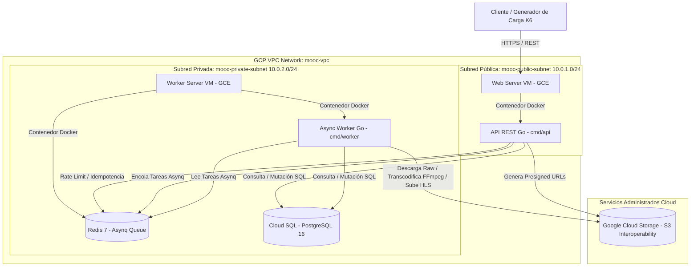

# 🏛️ Documento de Arquitectura de Software — Despliegue Cloud (GCP)
## Entrega 2: Despliegue Básico en la Nube Pública

---

## 📋 1. Visión General y Modelo de Componentes Cloud

La arquitectura desplegada en **Google Cloud Platform (GCP)** traslada la solución monolítica modular en Go desarrollada en la Entrega 1 a una infraestructura como servicio (IaaS) con persistencia administrada en la nube.

---

## ⚙️ 2. Correspondencia de Servicios en GCP

| Componente de Aplicación | Servicio GCP | Configuración Especificada |
| :--- | :--- | :--- |
| **Punto de Entrada API** | Compute Engine (GCE) `web-server` | 2 vCPU, 2 GiB RAM, 30 GB Balanced Disk (IP Pública) |
| **Worker Asíncrono** | Compute Engine (GCE) `worker-server` | 2 vCPU, 2 GiB RAM, 30 GB Balanced Disk (IP Privada) |
| **Cola Asynq & Caché** | Redis 7 en Contenedor Docker | Ejecutado dentro de `worker-server` (Puerto 6379 privado) |
| **Base de Datos Relacional** | Cloud SQL for PostgreSQL 16 | Instancia monozona con Private IP en `mooc-vpc` |
| **Almacenamiento de Objetos** | Google Cloud Storage (GCS) | Buckets `mooc-media` y `mooc-badges` (API Interoperabilidad S3 / HMAC) |
| **Red & Seguridad** | VPC Network & Subnets | `mooc-public-subnet` (10.0.1.0/24), `mooc-private-subnet` (10.0.2.0/24), Cloud NAT |

---

## 🔒 3. Decisiones de Seguridad y Aislamiento de Red

1. **Aislamiento de Componentes**:
   - `web-server` es el único componente expuesto a Internet en la subred pública (`10.0.1.0/24`).
   - `worker-server`, `Redis` y `Cloud SQL` residen exclusivamente en la subred privada (`10.0.2.0/24`) sin IPs públicas de entrada.
   - La comunicación saliente del `worker-server` para descarga de paquetes e imágenes Docker se canaliza vía **Cloud NAT**.
2. **Firewall / Security Groups**:
   - `allow-web-ingress`: Permite TCP 80/443 desde `0.0.0.0/0` a la VM `web-server`.
   - `allow-internal`: Permite tráfico interno TCP/UDP dentro del rango VPC `10.0.0.0/16`.
3. **Manejo de Secretos**:
   - Ninguna clave privada o secreto se almacena en el repositorio.
   - Las variables de entorno se inyectan en tiempo de ejecución mediante los archivos `web-server.env` y `worker-server.env`.

---

## 🛠️ 4. Guía de Operación y Recuperación

### Despliegue Inicial
1. Aprovisionar la red VPC, subredes, Cloud NAT, Cloud SQL e instancias GCE mediante `gcloud` o la consola GCP.
2. Clonar el repositorio en `web-server` y `worker-server`.
3. Copiar las plantillas `.env.example` a `.env` y configurar credenciales reales de Cloud SQL y HMAC Keys de GCS.
4. En `worker-server`: `docker compose -f deploy/docker-compose.worker.yml up -d`
5. En `web-server`: `docker compose -f deploy/docker-compose.web.yml up -d`

### Migración y Respaldo de Base de Datos
- Las migraciones SQL se ejecutan automáticamente al inicio de la aplicación o manualmente con `golang-migrate` desde el `web-server`.
- Los respaldos automáticos están activados en Cloud SQL con retención diaria.
